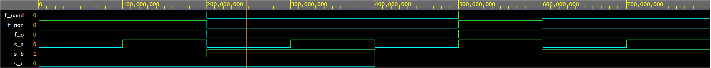
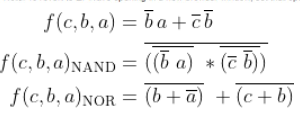
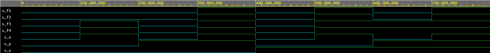

# Digital-electronics-1

## 1.) Gates
### 1.)
Odkaz [GitHub](https://github.com/HankaK-git/Digital-electronics-1.0)

### 2.)
**Odkaz na EDA Playground**

Simulace na EDA Playground [Zde](https://www.edaplayground.com/x/cXky).

**Zdrojový kód**

```
architecture dataflow of gates is 
begin 
	 f_i <= (not b_i and a_i) or (not c_i and not b_i);
     f_nandi <= not (not (not b_i and a_i) and (not(not c_i and not b_i)));
     f_nori <= not (b_i or not a_i) or (not (c_i or b_i));     
end architecture dataflow;

```


**Simulace De-Morganových zákonů, vzorce**



**Tabulka hodnot**
| **c** | **b** |**a** | **f(c,b,a)** |
| :-: | :-: | :-: | :-: |
| 0 | 0 | 0 | 1 |
| 0 | 0 | 1 | 1 |
| 0 | 1 | 0 | 0 |
| 0 | 1 | 1 | 0 |
| 1 | 0 | 0 | 0 |
| 1 | 0 | 1 | 1 |
| 1 | 1 | 0 | 0 |
| 1 | 1 | 1 | 0 |


### 3.)
**Odkaz na EDA Playground**

Simulace na EDA Playground [Zde](https://www.edaplayground.com/x/pt85).

**Zdrojový kód**

```
architecture dataflow of gates is 
begin 
	 f_1 <= (x_i and y_i) or (x_i and z_i);
     f_2 <= x_i and (y_i or z_i);
     f_3 <= (x_i or y_i) and (x_i or z_i);
     f_4 <= x_i or (y_i and z_i);
     
end architecture dataflow;
```
f1=f2
f3=f4

**Simulace Distribučních funkcí, vzorce**



