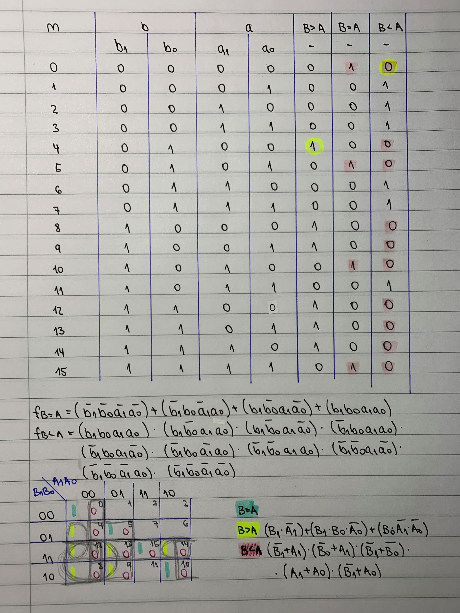

# Laborka 2

## Tabulka hodnot


## syntaxe design. vhd
```  
entity comparator_4bit is
    port(
      a_i           : in  std_logic_vector(4 - 1 downto 0);
      b_i           : in  std_logic_vector(4 - 1 downto 0);

		B_greater_A_o : out std_logic;
    B_equals_A_o  : out std_logic;     
		B_less_A_o    : out std_logic
    );
end entity comparator_4bit;

architecture Behavioral of comparator_4bit is
begin

	B_greater_A_o   <= '1' when (b_i > a_i) else '0';
	B_equals_A_o    <= '1' when (b_i = a_i) else '0';
  B_less_A_o      <= '1' when (b_i < a_i) else '0';


end architecture Behavioral;

```

## testbench. vhd
```
entity tb_comparator_4bit is
    -- Entity of testbench is always empty
end entity tb_comparator_4bit;

architecture testbench of tb_comparator_4bit is

    -- Local signals
    signal s_a       : std_logic_vector(4 - 1 downto 0);
    signal s_b       : std_logic_vector(4 - 1 downto 0);
    signal s_B_greater_A : std_logic;
    signal s_B_equals_A  : std_logic;
    signal s_B_less_A    : std_logic;

begin
   
    uut_comparator_4bit : entity work.comparator_4bit
        port map(
            a_i           => s_a,
            b_i           => s_b,
            B_greater_A_o => s_B_greater_A,
            B_equals_A_o  => s_B_equals_A,
            B_less_A_o    => s_B_less_A
        );

    p_stimulus : process
    begin
        -- Report a note at the begining of stimulus process
        report "Stimulus process started" severity note;


        -- First test values
        s_b <= "0000"; s_a <= "0000"; 
        wait for 100 ns;
        -- Expected output
        assert ((s_B_greater_A = '0') and (s_B_equals_A = '1') and (s_B_less_A = '0'))
        -- If false, then report an error
        report "Test failed for input combination: 0000, 0000" severity error;
        
        s_b <= "0000"; s_a <= "0100"; 
        wait for 100 ns;
        assert ((s_B_greater_A = '0') and (s_B_equals_A = '0') and (s_B_less_A = '1'))
        report "Chyba pro vstupní kombinaci: 0000, 0100" severity error;
       
        s_b <= "0000"; s_a <= "1000"; 
        wait for 100 ns;
        assert ((s_B_greater_A = '0') and (s_B_equals_A = '0') and (s_B_less_A = '1'))
        report "Chyba pro vstupní kombinaci: 0000, 1000" severity error;
        
        s_b <= "0000"; s_a <= "1100"; 
        wait for 100 ns;
        assert ((s_B_greater_A = '0') and (s_B_equals_A = '0') and (s_B_less_A = '1'))
        report "Chyba pro vstupní kombinaci: 0000, 1100" severity error;

		s_b <= "0100"; s_a <= "0000"; 
        wait for 100 ns;
        assert ((s_B_greater_A = '1') and (s_B_equals_A = '0') and (s_B_less_A = '0'))
        report "Chyba pro vstupní kombinaci: 0100, 0000" severity error;
        
        s_b <= "0100"; s_a <= "0100"; 
        wait for 100 ns;
        assert ((s_B_greater_A = '0') and (s_B_equals_A = '1') and (s_B_less_A = '0'))
        report "Chyba pro vstupní kombinaci: 0100, 0100" severity error;
        
        s_b <= "0100"; s_a <= "1000"; 
        wait for 100 ns;
        assert ((s_B_greater_A = '0') and (s_B_equals_A = '0') and (s_B_less_A = '1'))
        report "Chyba pro vstupní kombinaci: 0100, 1000" severity error;
        
        s_b <= "0100"; s_a <= "1100"; 
        wait for 100 ns;
        assert ((s_B_greater_A = '0') and (s_B_equals_A = '0') and (s_B_less_A = '1'))
        report "Chyba pro vstupní kombinaci: 0100, 1100" severity error;
        
        s_b <= "1000"; s_a <= "0000"; 
        wait for 100 ns;
        assert ((s_B_greater_A = '1') and (s_B_equals_A = '0') and (s_B_less_A = '0'))
        report "Chyba pro vstupní kombinaci: 1000, 0000" severity error;
        
        s_b <= "1000"; s_a <= "0100"; 
        wait for 100 ns;
        assert ((s_B_greater_A = '1') and (s_B_equals_A = '0') and (s_B_less_A = '1'))
        report "Chyba pro vstupní kombinaci: 1000, 0100" severity error;
        
        s_b <= "1000"; s_a <= "1000"; 
        wait for 100 ns;
        assert ((s_B_greater_A = '0') and (s_B_equals_A = '1') and (s_B_less_A = '0'))
        report "Chyba pro vstupní kombinaci: 1000, 1000" severity error;
        
        
        report "Stimulus process finished" severity note;
        wait;
    end process p_stimulus;

end architecture testbench;
```

## log
```
analyze design.vhd
analyze testbench.vhd
elaborate tb_comparator_4bit
testbench.vhd:51:9:@0ms:(report note): Stimulus process started
testbench.vhd:104:9:@1us:(assertion error): Chyba pro vstupní kombinaci: 1000, 0100
testbench.vhd:117:9:@1100ns:(report note): Stimulus process finished
Finding VCD file...
./dump.vcd

```
Odkaz na edaplayground: https://www.edaplayground.com/x/cdJk
