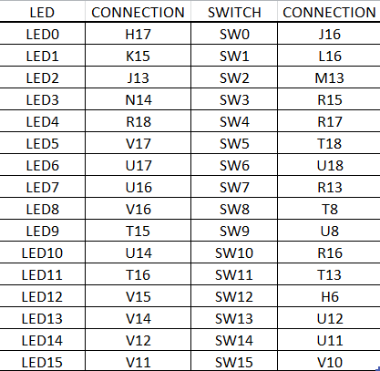

# Vivado

## 1)



## 2)

### Architecture

```vhdl
architecture Behavioral of mux_2bit_4to1 is
begin
    f_o <= a_i when (sel_i = "00") 
    else b_i when (sel_i = "01") 
    else c_i when (sel_i = "10") 
    else d_i; 
           
end architecture Behavioral;
```

### Process

```vhdl
p_stimulus : process
    begin
        report "Stimulus process started" severity note;

        s_d <= "00"; s_c <= "00"; s_b <= "00"; s_a <= "00"; 
        s_sel <= "00"; wait for 100 ns;
        
        s_d <= "10"; s_c <= "01"; s_b <= "01"; s_a <= "00";
        s_sel <= "00"; wait for 100 ns;
        
        s_d <= "10"; s_c <= "01"; s_b <= "01"; s_a <= "11"; 
        s_sel <= "00"; wait for 100 ns;
                
        s_d <= "10"; s_c <= "01"; s_b <= "01"; s_a <= "00"; 
        s_sel <= "01"; wait for 100 ns;
        
        s_d <= "10"; s_c <= "01"; s_b <= "11"; s_a <= "00";
        s_sel <= "01"; wait for 100 ns;

        report "Stimulus process finished" severity note;
        wait;
    end process p_stimulus;
```


## 3)


