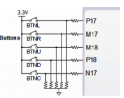

# Lab 05-counter

## 1. Preparation tasks



| **Time interval** | **Number of clk periods** | **Number of clk periods in hex** | **Number of clk periods in binary** |
   | :-: | :-: | :-: | :-: |
   | 2&nbsp;ms | 200 000 | `x"3_0d40"` | `b"0011_0000_1101_0100_0000"` |
   | 4&nbsp;ms | 400 000 | `x"6_1A80"` | `b"0110_0001_1010_1000_0000"` |
   | 10&nbsp;ms | 1 000 000 | `x"F_4240"` | `b"1111_0100_0010_0100_0000"` |
   | 250&nbsp;ms | 25 000 000 | `x"17D_7840"` | `b"0001_0111_1101_0111_1000_0100_0000"` |
   | 500&nbsp;ms | 50 000 000 | `x"2FA_F080"` | `b"0010_1111_1010_1111_0000_1000_0000"` |
   | 1&nbsp;sec | 100 000 000 | `x"5F5_E100"` | `b"0101_1111_0101_1110_0001_0000_0000"` |
   

## 2. Bidirectional counter
Listing of VHDL code of the process p_cnt_up_down
```
p_cnt_up_down : process(clk)
    begin
        if rising_edge(clk) then
        
            if (reset = '1') then               -- Synchronous reset
                s_cnt_local <= (others => '0'); -- Clear all bits

            elsif (en_i = '1') then       -- Test if counter is enabled
                -- TEST COUNTER DIRECTION HERE
                if (cnt_up_i = '1') then
                    s_cnt_local <= s_cnt_local + 1;
                else
                    s_cnt_local <= s_cnt_local - 1;
                end if;
            end if;
        end if;
    end process p_cnt_up_down;
```

Listing of VHDL reset and stimulus processes from testbench file tb_cnt_up_down.vhd
Reset process
```
p_reset_gen : process
 begin
     s_reset <= '0';
     wait for 12 ns;
     
     -- Reset activated
     s_reset <= '1';
     wait for 73 ns;
     
     s_reset <= '0';
     wait;
 end process p_reset_gen;
```
Stimulus process
```
p_stimulus : process
    begin
        report "Stimulus process started" severity note;

        -- Enable counting
        s_en     <= '1';
        
        -- Change counter direction
        s_cnt_up <= '1';
        wait for 380 ns;
        s_cnt_up <= '0';
        wait for 220 ns;

        -- Disable counting
        s_en     <= '0';

        report "Stimulus process finished" severity note;
        wait;
    end process p_stimulus;
```


## 3. Top level
```
library IEEE;
use IEEE.STD_LOGIC_1164.ALL;


entity top is
    Port ( 
           CLK100MHZ : in STD_LOGIC;
           BTNC : in STD_LOGIC;
           SW : in STD_LOGIC_VECTOR (1-1 downto 0);
           LED : out STD_LOGIC_VECTOR (4-1 downto 0);
           CA : out STD_LOGIC;
           CB : out STD_LOGIC;
           CC : out STD_LOGIC;
           CD : out STD_LOGIC;
           CE : out STD_LOGIC;
           CF : out STD_LOGIC;
           CG : out STD_LOGIC;
           AN : out STD_LOGIC_VECTOR (8-1 downto 0));
end top;


architecture Behavioral of top is

    -- Internal clock enable
    signal s_en  : std_logic;
    -- Internal counter
    signal s_cnt : std_logic_vector(4 - 1 downto 0);

begin

    clk_en0 : entity work.clock_enable
        generic map(
            --- WRITE YOUR CODE HERE
            g_MAX => 10000000
        )
        port map(
            --- WRITE YOUR CODE HERE
            clk   => CLK100MHZ,
            reset => BTNC,
            ce_o  => s_en
            
        );

    bin_cnt0 : entity work.cnt_up_down
        generic map(
            --- WRITE YOUR CODE HERE
            g_CNT_WIDTH => 4
        )
        port map(
            --- WRITE YOUR CODE HERE
            clk      => CLK100MHZ,
            reset    => BTNC,
            en_i     => s_en,
            cnt_up_i => SW(0),
            cnt_o    => s_cnt
        );

    -- Display input value on LEDs
    LED(3 downto 0) <= s_cnt;

    hex2seg : entity work.hex_7seg
        port map(
            hex_i    => s_cnt,
            seg_o(6) => CA,
            seg_o(5) => CB,
            seg_o(4) => CC,
            seg_o(3) => CD,
            seg_o(2) => CE,
            seg_o(1) => CF,
            seg_o(0) => CG
        );

    AN <= b"1111_1110";

end architecture Behavioral;
```

